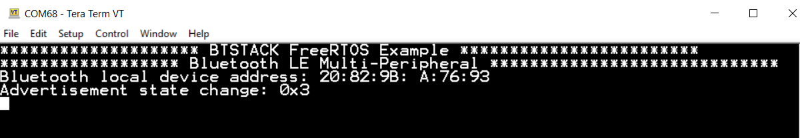
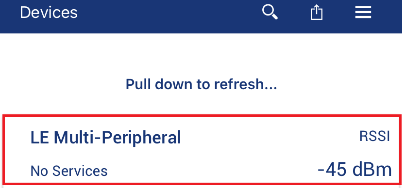
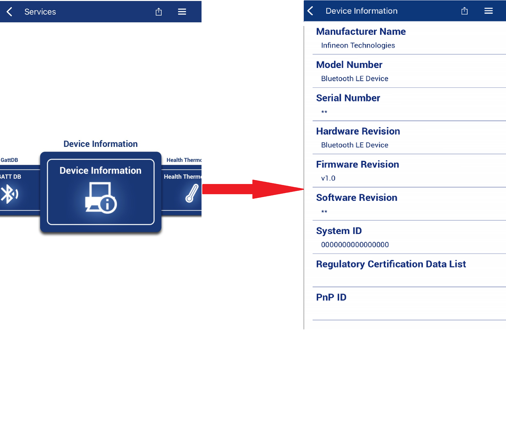
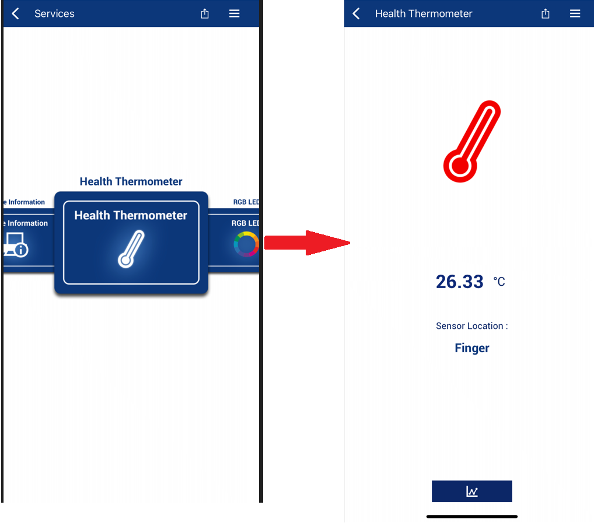
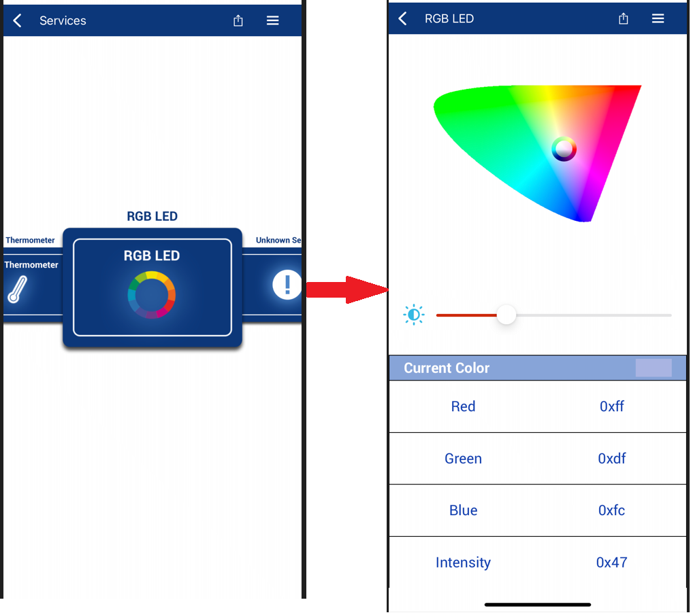

# BTSTACK: Bluetooth&reg; LE multi-peripheral

This code example demonstrates the implementation of multi-peripheral functionality using AIROC&trade; CYW20829, PSoC&trade; 6 Bluetooth&reg; LE device, and ModusToolbox&trade; software environment.

[View this README on GitHub.](https://github.com/Infineon/mtb-example-btstack-freertos-multi-peripheral)

[Provide feedback on this code example.](https://yourvoice.infineon.com/jfe/form/SV_1NTns53sK2yiljn?Q_EED=eyJVbmlxdWUgRG9jIElkIjoiQ0UyMzg0MTUiLCJTcGVjIE51bWJlciI6IjAwMi0zODQxNSIsIkRvYyBUaXRsZSI6IkJUU1RBQ0s6IEJsdWV0b290aCZyZWc7IExFIG11bHRpLXBlcmlwaGVyYWwiLCJyaWQiOiJwLnl1Z2FuZGhhckBpbmZpbmVvbi5jb20iLCJEb2MgdmVyc2lvbiI6IjQuMC4wIiwiRG9jIExhbmd1YWdlIjoiRW5nbGlzaCIsIkRvYyBEaXZpc2lvbiI6Ik1DRCIsIkRvYyBCVSI6IklDVyIsIkRvYyBGYW1pbHkiOiJCVEFCTEUifQ==)

## Requirements

- [ModusToolbox&trade; software](https://www.infineon.com/modustoolbox) v3.2 or later (tested with v3.2)
- Board support package (BSP) minimum required version for:
   - CY8CKIT-062-BLE: v4.0.0
   - CYBLE-416045-EVAL: v4.0.0
   - CYW920829M2EVK-02: v2.0.0
 - Programming language: C
- Associated parts: [AIROC&trade; CYW20829 Bluetooth&reg; LE SoC](https://www.infineon.com/cms/en/product/promopages/airoc20829), [PSoC&trade; 6 MCU with AIROC&trade; Bluetooth&reg; LE](https://www.infineon.com/cms/en/product/microcontroller/32-bit-psoc-arm-cortex-microcontroller/psoc-6-32-bit-arm-cortex-m4-mcu/psoc-63/)


## Supported toolchains (make variable 'TOOLCHAIN')

- GNU Arm&reg; Embedded Compiler v10.3.1 (`GCC_ARM`) – Default value of `TOOLCHAIN`
- Arm&reg; Compiler v6.16 (`ARM`)
- IAR C/C++ Compiler v9.30.1 (`IAR`)


## Supported kits (make variable 'TARGET')

- [PSoC&trade; 6 Bluetooth&reg; LE Pioneer Kit](https://www.infineon.com/CY8CKIT-062-BLE) (`CY8CKIT-062-BLE`) – Default value of `TARGET`
- [EZ-BLE Arduino Evaluation Board](https://www.infineon.com/cms/en/product/evaluation-boards/cyble-416045-eval/) (`CYBLE-416045-EVAL`)
- [AIROC&trade; CYW20829 Bluetooth&reg; LE SoC](https://www.infineon.com/cms/en/product/promopages/airoc20829) (`CYW920829M2EVK-02`)


## Hardware setup

This example uses the board's default configuration. See the kit user guide to ensure that the board is configured correctly.

 **Table 1. Thermistor pins configuration**

 Kit  |  Thermistor VDD pin     |    Thermistor output signal 1 pin     |    Thermistor output signal 2 pin   |   Thermistor Ground pin
 :------- | :------------    | :------------ | :------------ | :------------
 CY8CKIT-062-BLE    | P10[0]         | P10[1] | P10[2] | P10[3]
 CYBLE-416045-EVAL    | P10[4]         | P10[5] | P10[2] | P10[3]
 CYW920829M2EVK-02    | NC         | P3[4] | NC | NC

**Note:** The PSoC&trade; 6 Bluetooth&reg; LE pioneer kit (CY8CKIT-062-BLE) ship with KitProg2 installed. ModusToolbox&trade; requires KitProg3. Before using this code example, make sure that the board is upgraded to KitProg3. The tool and instructions are available in the [Firmware Loader](https://github.com/Infineon/Firmware-loader) GitHub repository. If you do not upgrade, you will see an error like "unable to find CMSIS-DAP device" or "KitProg firmware is out of date".

The AIROC&trade; CYW20829 Bluetooth&reg; kit (CYW920829M2EVK-02) ships with KitProg3 version 2.30 installed. ModusToolbox&trade; requires KitProg3 with latest version 2.40. Before using this code example, make sure that the board is upgraded to KitProg3. The tool and instructions are available in the Firmware Loader GitHub repository. If you do not upgrade, you will see an error such as "unable to find CMSIS-DAP device" or "KitProg firmware is out of date".

## Software setup

For the locator, download and install the AIROC&trade; Bluetooth&reg; Connect App on your [Android](https://play.google.com/store/apps/details?id=com.infineon.airocbluetoothconnect) or [iOS](https://apps.apple.com/in/app/airoc-bluetooth-connect-app/id6443702288) phone.
Scan the following QR codes from your mobile phone to download the AIROC&trade; Bluetooth&reg; Connect app.


Install a terminal emulator if you don't have one. Instructions in this document use [Tera Term](https://ttssh2.osdn.jp/index.html.en).

This example requires no additional software or tools.


## Using the code example

Create the project and open it using one of the following:

<details><summary><b>In Eclipse IDE for ModusToolbox&trade;</b></summary>

1. Click the **New Application** link in the **Quick Panel** (or, use **File** > **New** > **ModusToolbox&trade; Application**). This launches the [Project Creator](https://www.infineon.com/ModusToolboxProjectCreator) tool.

2. Pick a kit supported by the code example from the list shown in the **Project Creator - Choose Board Support Package (BSP)** dialog.

   When you select a supported kit, the example is reconfigured automatically to work with the kit. To work with a different supported kit later, use the [Library Manager](https://www.infineon.com/ModusToolboxLibraryManager) to choose the BSP for the supported kit. You can use the Library Manager to select or update the BSP and firmware libraries used in this application. To access the Library Manager, click the link from the **Quick Panel**.

   You can also just start the application creation process again and select a different kit.

   If you want to use the application for a kit not listed here, you may need to update the source files. If the kit does not have the required resources, the application may not work.

3. In the **Project Creator - Select Application** dialog, choose the example by enabling the checkbox.

4. (Optional) Change the suggested **New Application Name**.

5. The **Application(s) Root Path** defaults to the Eclipse workspace which is usually the desired location for the application. If you want to store the application in a different location, you can change the *Application(s) Root Path* value. Applications that share libraries should be in the same root path.

6. Click **Create** to complete the application creation process.

For more details, see the [Eclipse IDE for ModusToolbox&trade; user guide](https://www.infineon.com/MTBEclipseIDEUserGuide) (locally available at *{ModusToolbox&trade; install directory}/docs_{version}/mt_ide_user_guide.pdf*).

</details>

<details><summary><b>In command-line interface (CLI)</b></summary>

ModusToolbox&trade; provides the Project Creator as both a GUI tool and the command line tool, "project-creator-cli". The CLI tool can be used to create applications from a CLI terminal or from within batch files or shell scripts. This tool is available in the *{ModusToolbox&trade; install directory}/tools_{version}/project-creator/* directory.

Use a CLI terminal to invoke the "project-creator-cli" tool. On Windows, use the command line "modus-shell" program provided in the ModusToolbox&trade; installation instead of a standard Windows command-line application. This shell provides access to all ModusToolbox&trade; tools. You can access it by typing `modus-shell` in the search box in the Windows menu. In Linux and macOS, you can use any terminal application.

The "project-creator-cli" tool has the following arguments:

Argument | Description | Required/optional
---------|-------------|-----------
`--board-id` | Defined in the `<id>` field of the [BSP](https://github.com/Infineon?q=bsp-manifest&type=&language=&sort=) manifest | Required
`--app-id`   | Defined in the `<id>` field of the [CE](https://github.com/Infineon?q=ce-manifest&type=&language=&sort=) manifest | Required
`--target-dir`| Specify the directory in which the application is to be created if you prefer not to use the default current working directory | Optional
`--user-app-name`| Specify the name of the application if you prefer to have a name other than the example's default name | Optional

<br>

The following example clones the "[Bluetooth&reg; LE multi-peripheral](https://github.com/Infineon/mtb-example-btstack-freertos-multi-peripheral)" application with the desired name "multi-peripheral" configured for the *CY8CKIT-062-BLE* BSP into the specified working directory, *C:/mtb_projects*:

   ```
   project-creator-cli --board-id CY8CKIT-062-BLE --app-id mtb-example-btstack-freertos-multi-peripheral --user-app-name multi-peripheral --target-dir "C:/mtb_projects"
   ```

**Note:** The project-creator-cli tool uses the `git clone` and `make getlibs` commands to fetch the repository and import the required libraries. For details, see the "Project creator tools" section of the [ModusToolbox&trade; user guide](https://www.infineon.com/ModusToolboxUserGuide) (locally available at *{ModusToolbox&trade; install directory}/docs_{version}/mtb_user_guide.pdf*).

To work with a different supported kit later, use the [Library Manager](https://www.infineon.com/ModusToolboxLibraryManager) to choose the BSP for the supported kit. You can invoke the Library Manager GUI tool from the terminal using `make library-manager` command or use the Library Manager CLI tool "library-manager-cli" to change the BSP.

The "library-manager-cli" tool has the following arguments:

Argument | Description | Required/optional
---------|-------------|-----------
`--add-bsp-name` | Name of the BSP that should be added to the application | Required
`--set-active-bsp` | Name of the BSP that should be as active BSP for the application | Required
`--add-bsp-version`| Specify the version of the BSP that should be added to the application if you do not wish to use the latest from manifest | Optional
`--add-bsp-location`| Specify the location of the BSP (local/shared) if you prefer to add the BSP in a shared path | Optional

<br>

</details>

<details><summary><b>In third-party IDEs</b></summary>

Use one of the following options:

- **Use the standalone [Project Creator](https://www.infineon.com/ModusToolboxProjectCreator) tool:**

   1. Launch Project Creator from the Windows Start menu or from *{ModusToolbox&trade; install directory}/tools_{version}/project-creator/project-creator.exe*.

   2. In the initial **Choose Board Support Package** screen, select the BSP, and click **Next**.

   3. In the **Select Application** screen, select the appropriate IDE from the **Target IDE** drop-down menu.

   4. Click **Create** and follow the instructions printed in the bottom pane to import or open the exported project in the respective IDE.

<br>

- **Use command-line interface (CLI):**

   1. Follow the instructions from the **In command-line interface (CLI)** section to create the application.

   2. Export the application to a supported IDE using the `make <ide>` command.

   3. Follow the instructions displayed in the terminal to create or import the application as an IDE project.

For a list of supported IDEs and more details, see the "Exporting to IDEs" section of the [ModusToolbox&trade; user guide](https://www.infineon.com/ModusToolboxUserGuide) (locally available at *{ModusToolbox&trade; install directory}/docs_{version}/mtb_user_guide.pdf*).

</details>


## Operation

1. Connect the board to your PC using the provided USB cable through the KitProg3 USB connector.

2. Use your favorite serial terminal application and connect to the KitProg3 COM port. Configure the terminal application to access the serial port using the following settings.

   Baud rate: 115200 bps; Data: 8 bits; Parity: None; stop: 1 bit; Flow control: None; New line for receiving data: Line Feed(LF) or auto setting

3. Program the board using one of the following:

   <details><summary><b>Using Eclipse IDE for ModusToolbox&trade;</b></summary>

      1. Select the application project in Project Explorer.

      2. In the **Quick Panel**, scroll down, and click **\<Application Name> Program (KitProg3_MiniProg4)**.

   </details>

   <details><summary><b>Using CLI</b></summary>

     From the terminal, execute the `make program` command to build and program the application using the default toolchain to the default target. The default toolchain and target are specified in the application's Makefile but you can override those values manually:
      ```
      make program TARGET=<BSP> TOOLCHAIN=<toolchain>
      ```

      Example:
      ```
      make program TARGET=CY8CKIT-062-BLE TOOLCHAIN=GCC_ARM
      ```
   </details>

4. After programming, the application starts automatically. Observe the messages on the UART terminal. The device starts advertising with the name "LE Multi-Peripheral". Use a peer client app like AIROC&trade; Bluetooth&reg; Connect app to scan and connect with the device. Use the KitProg3 COM port to view the Bluetooth&reg; stack and application trace messages in the terminal window:

   **Figure 1. Log messages on KitProg3 COM port**

   


## Testing using the AIROC&trade; Bluetooth&reg; Connect mobile app

1. Turn ON Bluetooth&reg; on your Android or iOS device.

2. Launch the AIROC&trade; Bluetooth&reg; Connect app.

3. Swipe down on the AIROC&trade; Bluetooth&reg; Connect app home screen to start scanning for Bluetooth&reg; LE peripherals; your device "LE Multi-Peripheral" appears on the AIROC&trade; Bluetooth&reg; Connect app home screen.

4. Pull down the AIROC&trade; Bluetooth&reg; Connect app home screen to start scanning for Bluetooth LE Peripherals; your device appears in the AIROC&trade; Bluetooth&reg; Connect app home screen as shown in Figure 2. Select your device to establish a Bluetooth LEconnection.

   **Figure 2. AIROC&trade; Bluetooth&reg; Connect app home screen**

   

5. To connect another device, repeat steps 1 to 4. Up to four Central devices can be connected to the device.

6. On one or more of the connected devices, select the Device Information profile to get the device information, as shown in Figure 3.

   **Figure 3.Locating device information using AIROC&trade; Bluetooth&reg; Connect app**

   

7. Select the Health Thermometer profile to get the temperature information as shown in Figure 4.

   **Figure 4.  Locating and using Health Thermometer service Using AIROC&trade; Bluetooth&reg; Connect app**

   

8. Select the RGB LED profile to change the color of the RGB LED present in the kit as shown in Figure 5.

   **Figure 5. Locating and using RGB LED service using AIROC&trade; Bluetooth&reg; Connect app**

   

9. Custom Service and Custom Notification Service can be accessed through the GattDB profile. The service can be identified using its Universally Unique Identifier (UUID).

10. Locate the Custom Service characteristic (UUID `E624B3AA-3397-4FC5-A7B0-4ACB2776687D`). Using this service, a GAP Central device can read or write 128-bit data.

11. Locate the Custom Notification Service characteristic (UUID `3D62A222-42FB-43B0-B0A0-C9D9D55AC8D9`). This service is used to notify the GAP Central device that last modified any of the characteristics. The data payload contains three bytes of information.

- XXXXYY -> XXXX device ID. (0000 -> Default, 8000 to 8003),
         -> YY characteristics (00 -> Default, 01 -> RGB LED, 02 -> Custom Service)


## Debugging

You can debug the example to step through the code. In the IDE, use the **\<Application Name> Debug (KitProg3_MiniProg4)** configuration in the **Quick Panel**. For more details, see the "Program and debug" section in the [Eclipse IDE for ModusToolbox&trade; user guide](https://www.infineon.com/MTBEclipseIDEUserGuide).

**Note:** **(Only while debugging PSoC™ 6 MCU)** On the CM4 CPU, some code in `main()` may execute before the debugger halts at the beginning of `main()`. This means that some code executes twice - once before the debugger stops execution, and again after the debugger resets the program counter to the beginning of `main()`. See [KBA231071](https://community.infineon.com/t5/Knowledge-Base-Articles/PSoC-6-MCU-Code-in-main-executes-before-the-debugger-halts-at-the-first-line-of/ta-p/253856) to learn about this and for the workaround.

**Note:** Debugging is of limited value when there is an active Bluetooth&reg; LE connection because as soon as the Bluetooth&reg; LE device stops responding, the connection will get dropped.


## Design and implementation

This code example implements Bluetooth&reg; LE multi-peripheral functionality that consists of the following:
- Device Information service
- Health Thermometer service
- Custom service for RGB LED with color and intensity control
- 128-bit long characteristic read write custom service
- A custom notification service

In this application, the state of the RGB LED is controlled using PWM blocks. The PWM HAL resource is configured for controlling the brightness of the LED.

The device simulates thermistor readings and sends it over to the Health Thermometer service. CY8CKIT-028-EPD E-INK Display Shield is used and connect to the CY8CKIT-062-BLE and CYBLE-416045-EVAL kits. CY8CKIT-028-EPD E-INK Display Shield contains a thermistor sensor which is used for reading the temperature data. CYW920829M2EVK-02 kit has inbuilt thermistor sensor which is connected to the Analog Pin A0. For pin connections, see Table 1.

The custom service is used to transfer 128-bit data. The custom notification is used to send a notification to all connected devices about any changes. It sends 3-byte data; the first two bytes to notify the device that modified the data and the third byte to notify the characteristic data that has been modified.

The application uses a UART resource from the Hardware Abstraction Layer (HAL) to print debug messages on a UART terminal emulator. The UART resource initialization and retargeting of standard I/O to the UART port are done using the retarget-io library.

## Resources and settings

This section explains the ModusToolbox&trade; resources and their configurations as used in this code example. Note that all the configurations explained in this section have already been implemented in the code example.

- **Device Configurator:** ModusToolbox&trade; stores the configuration settings of the application in the *design.modus* file. This file is used by Device Configurator, which generates the configuration firmware. This firmware is stored in the application’s *GeneratedSource* folder.

   By default, all applications in a workspace share the same *design.modus* file - i.e., they share the same pin configuration. Each BSP has a default *design.modus* file in the *mtb_shared\TARGET_\<bsp name\>\<version\>\COMPONENT_BSP_DESIGN_MODUS* directory. It is not recommended to modify the configuration of a standard BSP directly.

   To modify the configuration for a single application or to create a custom BSP, see the [ModusToolbox&trade; user guide](https://www.infineon.com/ModusToolboxUserGuide). This example uses the default configuration. See the [Device Configurator guide](https://www.infineon.com/ModusToolboxDeviceConfig).

- **Bluetooth&reg; Configurator:** The Bluetooth&reg; Peripheral has an additional configurator called “Bluetooth&reg; Configurator” that is used to generate the Bluetooth&reg; LE GATT database and various Bluetooth&reg; settings for the application. These settings are stored in the file named *design.cybt*.

   Note that unlike Device Configurator, Bluetooth&reg; Configurator settings and files are local to each application. The services and characteristics added are explained in the [Design and implementation](#design-and-implementation) section. See the [Bluetooth&reg; Configurator guide](https://www.infineon.com/ModusToolboxBLEConfig).

**Note:** For PSoC&trade; 6 Bluetooth&reg; LE-based BSP (CY8CKIT-062-BLE) with support for AIROC&trade; BTSTACK, if you want to use Bluetooth&reg; Configurator, select the **AIROC&trade; BTSTACK with Bluetooth&reg; LE only (CYW20829, PSoC&trade; 6 with CYW43xxx Connectivity device)** option from the dropdown to select the device. Do not use the **PSoC&trade; Bluetooth&reg; LE Legacy Stack (PSoC&trade; 6-BLE)** option because it is not compatible with AIROC&trade; BTSTACK.

**Table 1. Application resources**

| Resource  |  Alias/object     |    Purpose     |
| :------- | :------------    | :------------ |
| UART (HAL)|cy_retarget_io_uart_obj| UART HAL object used by Retarget-IO for Debug UART port|
| GPIO (HAL)    | CYBSP_LED_RGB_RED, CYBSP_LED_RGB_BLUE, CYBSP_LED_RGB_BLUE   | These GPIOs are configured as firmware-controlled digital output pins that control LEDs |
| PWM (HAL)   | pwm_red, pwm_green, pwm_blue  | These PWMs are used to control the brightness of the LEDs. |
| ADC (HAL)     |adc|   Analog-to-digital converter driver |
<br>


## Related resources

Resources  | Links
-----------|----------------------------------
Application notes  | [AN228571](https://www.infineon.com/AN228571) – Getting started with PSoC&trade; 6 MCU on ModusToolbox&trade; <br>  [AN215656](https://www.infineon.com/AN215656) – PSoC&trade; 6 MCU: Dual-CPU system design
Code examples  | [Using ModusToolbox&trade;](https://github.com/Infineon/Code-Examples-for-ModusToolbox-Software) on GitHub
Device documentation | [PSoC&trade; 6 MCU datasheets](https://documentation.infineon.com/html/psoc6/bnm1651211483724.html) <br> [PSoC&trade; 6 technical reference manuals](https://documentation.infineon.com/html/psoc6/zrs1651212645947.html)<br>[AIROC&trade; CYW20829 Bluetooth&reg; LE SoC](https://www.infineon.com/cms/en/product/promopages/airoc20829)
Development kits | Select your kits from the [evaluation board finder](https://www.infineon.com/cms/en/design-support/finder-selection-tools/product-finder/evaluation-board)
Libraries on GitHub  | [mtb-pdl-cat1](https://github.com/Infineon/mtb-pdl-cat1) – PSoC&trade; 6 peripheral driver library (PDL)  <br> [mtb-hal-cat1](https://github.com/Infineon/mtb-hal-cat1) – Hardware abstraction layer (HAL) library <br> [retarget-io](https://github.com/Infineon/retarget-io) – Utility library to retarget STDIO messages to a UART port
Middleware on GitHub  | [capsense](https://github.com/Infineon/capsense) – CAPSENSE&trade; library and documents <br> [psoc6-middleware](https://github.com/Infineon/modustoolbox-software#psoc-6-middleware-libraries) – Links to all PSoC&trade; 6 MCU middleware
Tools  | [Eclipse IDE for ModusToolbox&trade;](https://www.infineon.com/modustoolbox) – ModusToolbox&trade; is a collection of easy-to-use software and tools enabling rapid development with Infineon MCUs, covering applications from embedded sense and control to wireless and cloud-connected systems using AIROC&trade; Wi-Fi and Bluetooth&reg; connectivity devices.

<br>

## Other resources

Infineon provides a wealth of data at www.infineon.com to help you select the right device, and quickly and effectively integrate it into your design.

For PSoC&trade; 6 MCU devices, see [How to design with PSoC&trade; 6 MCU – KBA223067](https://community.infineon.com/docs/DOC-14644) in Infineon Developer Community.

## Document history

Document title: *CE238415* – *Bluetooth&reg; LE multi-peripheral*

| Version | Description of change |
| ------- | --------------------- |
| 1.0.0   | New code example      |
| 2.0.0   | Updated to support ModusToolbox&trade; software v3.1 |
| 3.0.0   | BSP and BTStack-integration major update for BT Firmware
| 4.0.0   | Update MPN for CYW20829 and update Code Example with BTSTACK 5.0.0
-------------------------------------------------------------------------------

© Cypress Semiconductor Corporation, 2020-2024. This document is the property of Cypress Semiconductor Corporation, an Infineon Technologies company, and its affiliates ("Cypress").  This document, including any software or firmware included or referenced in this document ("Software"), is owned by Cypress under the intellectual property laws and treaties of the United States and other countries worldwide.  Cypress reserves all rights under such laws and treaties and does not, except as specifically stated in this paragraph, grant any license under its patents, copyrights, trademarks, or other intellectual property rights.  If the Software is not accompanied by a license agreement and you do not otherwise have a written agreement with Cypress governing the use of the Software, then Cypress hereby grants you a personal, non-exclusive, nontransferable license (without the right to sublicense) (1) under its copyright rights in the Software (a) for Software provided in source code form, to modify and reproduce the Software solely for use with Cypress hardware products, only internally within your organization, and (b) to distribute the Software in binary code form externally to end users (either directly or indirectly through resellers and distributors), solely for use on Cypress hardware product units, and (2) under those claims of Cypress’s patents that are infringed by the Software (as provided by Cypress, unmodified) to make, use, distribute, and import the Software solely for use with Cypress hardware products.  Any other use, reproduction, modification, translation, or compilation of the Software is prohibited.
<br>
TO THE EXTENT PERMITTED BY APPLICABLE LAW, CYPRESS MAKES NO WARRANTY OF ANY KIND, EXPRESS OR IMPLIED, WITH REGARD TO THIS DOCUMENT OR ANY SOFTWARE OR ACCOMPANYING HARDWARE, INCLUDING, BUT NOT LIMITED TO, THE IMPLIED WARRANTIES OF MERCHANTABILITY AND FITNESS FOR A PARTICULAR PURPOSE.  No computing device can be absolutely secure.  Therefore, despite security measures implemented in Cypress hardware or software products, Cypress shall have no liability arising out of any security breach, such as unauthorized access to or use of a Cypress product. CYPRESS DOES NOT REPRESENT, WARRANT, OR GUARANTEE THAT CYPRESS PRODUCTS, OR SYSTEMS CREATED USING CYPRESS PRODUCTS, WILL BE FREE FROM CORRUPTION, ATTACK, VIRUSES, INTERFERENCE, HACKING, DATA LOSS OR THEFT, OR OTHER SECURITY INTRUSION (collectively, "Security Breach").  Cypress disclaims any liability relating to any Security Breach, and you shall and hereby do release Cypress from any claim, damage, or other liability arising from any Security Breach.  In addition, the products described in these materials may contain design defects or errors known as errata which may cause the product to deviate from published specifications. To the extent permitted by applicable law, Cypress reserves the right to make changes to this document without further notice. Cypress does not assume any liability arising out of the application or use of any product or circuit described in this document. Any information provided in this document, including any sample design information or programming code, is provided only for reference purposes.  It is the responsibility of the user of this document to properly design, program, and test the functionality and safety of any application made of this information and any resulting product.  "High-Risk Device" means any device or system whose failure could cause personal injury, death, or property damage.  Examples of High-Risk Devices are weapons, nuclear installations, surgical implants, and other medical devices.  "Critical Component" means any component of a High-Risk Device whose failure to perform can be reasonably expected to cause, directly or indirectly, the failure of the High-Risk Device, or to affect its safety or effectiveness.  Cypress is not liable, in whole or in part, and you shall and hereby do release Cypress from any claim, damage, or other liability arising from any use of a Cypress product as a Critical Component in a High-Risk Device. You shall indemnify and hold Cypress, including its affiliates, and its directors, officers, employees, agents, distributors, and assigns harmless from and against all claims, costs, damages, and expenses, arising out of any claim, including claims for product liability, personal injury or death, or property damage arising from any use of a Cypress product as a Critical Component in a High-Risk Device. Cypress products are not intended or authorized for use as a Critical Component in any High-Risk Device except to the limited extent that (i) Cypress’s published data sheet for the product explicitly states Cypress has qualified the product for use in a specific High-Risk Device, or (ii) Cypress has given you advance written authorization to use the product as a Critical Component in the specific High-Risk Device and you have signed a separate indemnification agreement.
<br>
Cypress, the Cypress logo, and combinations thereof, WICED, ModusToolbox, PSoC, CapSense, EZ-USB, F-RAM, and Traveo are trademarks or registered trademarks of Cypress or a subsidiary of Cypress in the United States or in other countries. For a more complete list of Cypress trademarks, visit www.infineon.com. Other names and brands may be claimed as property of their respective owners.
